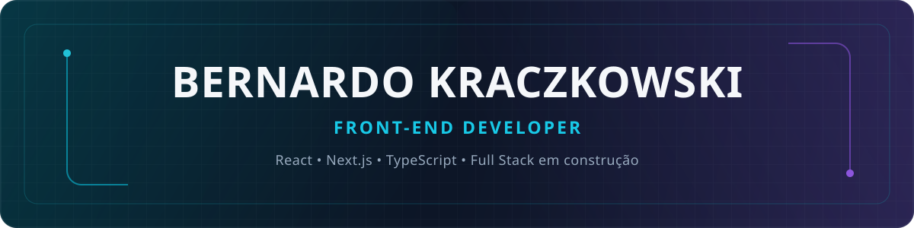

  

  

  
  

> PLAYER_PROFILE

player: Bernardo Kraczkowski
class: Front-end Developer
specialization: React · Next.js · interfaces responsivas
origin: Sertão, RS · Brasil
main_quest: construir produtos Full Stack
current_focus: projetos autorais, experiências digitais e aprendizado contínuo

Transformo regras de negócio e problemas reais em interfaces rápidas, claras e fáceis de manter. Minha experiência reúne desenvolvimento Front-end, integrações, e-commerce internacional, QA e acompanhamento pós-go-live.

> CHARACTER_BUILD

bernardo-kra/
├── interface      → React + TypeScript + componentes reutilizáveis
├── experience     → Responsividade + usabilidade + performance
├── integration    → APIs REST + Axios + regras de negócio
├── quality        → QA funcional + debugging + testes regressivos
└── next_level     → Node.js + PostgreSQL + arquitetura Full Stack

  
<strong>🌳 Abrir árvore de habilidades</strong>

   

Interface

  

    
    
    
    
    
    
    
  

React Hooks · Context API · HTML5 · CSS3 · Angular · Knockout.js · Web Components

Integração e dados

  

    
    
    
    
    
  

Oracle Commerce Cloud · Freemarker · integrações de pagamento · SQL

Qualidade e entrega

  

    
    
    
    
    
  

CI/CD · QA funcional · testes manuais e regressivos · debugging · Web Performance · SEO técnico

> QUEST_LOG

🟣 Missão principal: Guia Virtual

Construção de uma plataforma para conectar viajantes a conteúdos criados por guias de turismo verificados e agências autorizadas.

Arquitetura da missão: Next.js + React + TypeScript → Node.js + REST API → PostgreSQL

  
<strong>🗺️ Abrir mapa da missão</strong>

   

Home e descoberta de conteúdo

Lista e detalhes dos guias

Cadastro, login e perfil

Criação, edição e publicação de guias

Compra e acesso aos guias adquiridos

Documentação das decisões de arquitetura

Ciclo de desenvolvimento: Pensar → Pesquisar → Implementar → Explicar → Revisar

🔵 Missões paralelas

Aprofundar Next.js e TypeScript em projetos completos.

Evoluir a arquitetura de Front-end para Full Stack.

Transformar estudos em projetos públicos e documentados.

Contribuir com projetos open source de forma útil e verificável.

> COMPLETED_MISSIONS

Missão

Experiência desbloqueada

E-commerce internacional

Projetos para empresas do Brasil, México e Nicarágua

Interfaces de produto

Componentes React, responsividade, Tailwind CSS e Storybook

Checkout e integrações

APIs REST, Axios e diferentes meios de pagamento

Performance

Lazy loading, Suspense, React.lazy e análise de navegação

Quality gate

QA funcional, testes regressivos e validação antes de deploys

Delivery pipeline

Git, Bitbucket, Jenkins, branches e CI/CD

> ACHIEVEMENT_HUNT

Os Achievements abaixo são concedidos oficialmente pelo GitHub. Este quadro funciona como um registro de objetivos; cada conquista só deve ser marcada depois de aparecer no perfil.

Pull Shark — colaborar por meio de Pull Requests aceitos.

Pair Extraordinaire — desenvolver em coautoria real.

Galaxy Brain — contribuir com respostas úteis em Discussions.

Starstruck — criar projetos públicos que recebam reconhecimento orgânico.

  
<strong>🏆 Ver estratégia de conquista</strong>

   

A prioridade é usar issues, branches e Pull Requests reais no Guia Virtual, contribuir com documentação ou correções em projetos open source e participar de Discussions sobre tecnologias conhecidas. Nada de fabricar atividade apenas para colecionar badge — todo bom jogo pune quem tenta explorar o sistema.

> CO_OP_MODE

  
  

  Próxima missão: construir algo útil, bem explicado e pronto para evoluir.

